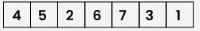

# Binary Tree
Data structure that allows for binary search

## Types of Binary Tree:

### Full Binary Tree
- Every node has either 0 or 2 children.

### Complete Binary Tree
- Every level is completely filled except for the last level
- The leaf elements must all lean towards the left
- It doesn't have to be full (i.e. the right most node might be none, but it's "sibling" can be filled, so the parent node has 1 child, etc.)

### Perfect Binary Tree
- Every node has 2 children except the last level where they all have 0 children
- Essentially means that all leaf nodes are on the same level
- Really useful for minimum height
- Enables faster searches

### Balanced Binary Tree
- One 1 height difference between each subtree of every node
- Provide O(log(n)) time for searches

## Traversal Options:

### Inorder Traversal

Left -> Root -> Right

Used for arithmetic expressions stored in binary trees

### Preorder Traversal

Root -> Left -> Right

Used to create copy of tree

### Postorder Traversal

Left -> Right -> Root

Used to delete tree

### Level Order Traversal

Used to operate on each level (e.g. max/min) or tree serialisation/deserialisation for efficient storage and reconstruction
